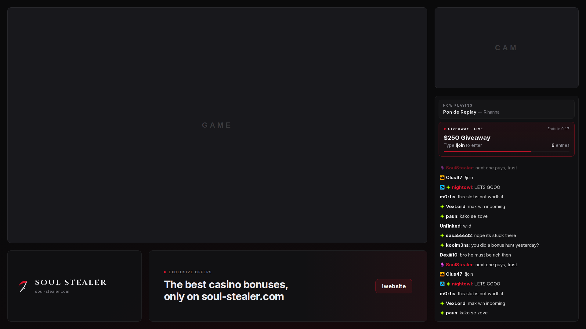
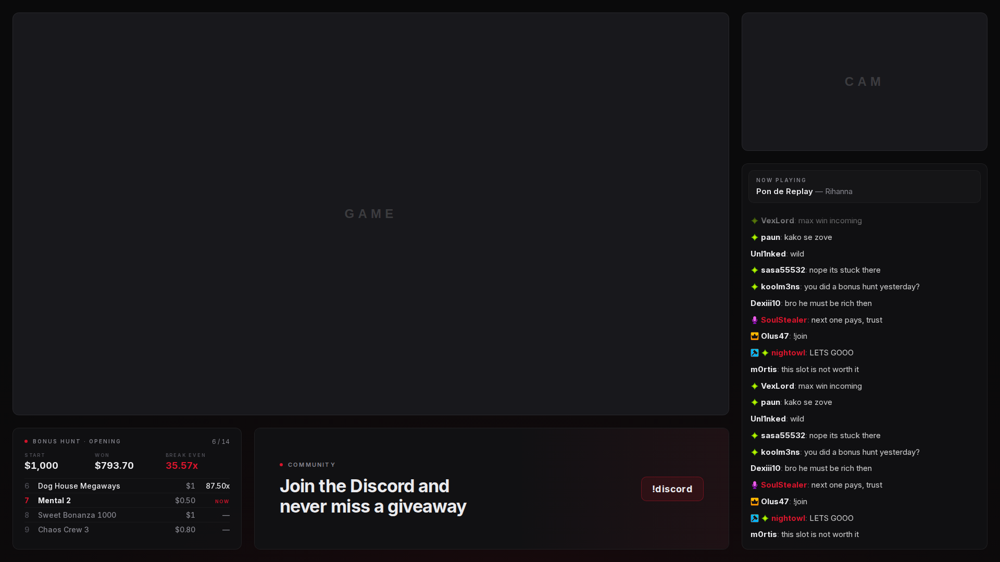

# Soul Stealer – OBS Overlay

Ein schlichtes Stream-Overlay für **Soul Stealer** ([soul-stealer.com](https://soul-stealer.com)) in Schwarz, Grau und einem Hauch Rot.

Es gibt **zwei Overlays**. Jedes ist genau **eine Browser Source mit 1920 × 1080**:

| Overlay | URL | Wofür |
| --- | --- | --- |
| Standard | `https://<deine-domain>/overlay` | Normale Streams. Unten links Logo, Name und Website |
| Hunt | `https://<deine-domain>/overlay/hunt` | Bonus-Hunt-Streams. Unten links der Bonus Hunt |

Alles andere ist auf beiden Overlays gleich: Chat mit „Now playing“ und Giveaways oben, großer Banner unten rechts.

**Standard**



**Hunt**



Auf beiden Overlays:

| Bereich | Inhalt | Datenquelle |
| --- | --- | --- |
| Links oben (groß) | Ausschnitt für das Spiel | – |
| Rechts oben | Ausschnitt für die Cam | – |
| Rechts | Kick-Chat. Ganz oben **Now playing**, solange ein Song läuft. Startet ein Giveaway, erscheint es **oben in der Chat-Box** und schiebt den Chat nach unten. Ist das Giveaway vorbei, verschwindet es wieder | Kick, Spotify, Giveaway-Modul auf soul-stealer.com |
| Links unten | Standard: Logo, Name, Website. Hunt: Bonus Hunt mit Bonusliste | `lib/config.ts` / bonushunt.gg |
| Rechts unten | Großer rotierender Banner, auf beiden Overlays | `lib/config.ts` |

Spiel und Cam sind **echte Löcher** im Overlay. Das Overlay liegt in OBS ganz oben, Spiel und Cam darunter scheinen durch. Den Chat zeichnet das Overlay selbst, dafür brauchst du keine eigene Chat-Quelle mehr.

---

## Inhalt

1. [Server vorbereiten](#1-server-vorbereiten)
2. [Projekt auf den Server holen](#2-projekt-auf-den-server-holen)
3. [Konfiguration anlegen (.env.local)](#3-konfiguration-anlegen-envlocal)
4. [bonushunt.gg verbinden](#4-bonushuntgg-verbinden)
5. [Kick-Chat einstellen](#5-kick-chat-einstellen)
6. [Giveaway-Modul verbinden](#6-giveaway-modul-verbinden)
7. [Spotify verbinden](#7-spotify-verbinden)
8. [Bauen und dauerhaft starten (PM2)](#8-bauen-und-dauerhaft-starten-pm2)
9. [Domain und HTTPS (nginx)](#9-domain-und-https-nginx)
10. [In OBS einrichten](#10-in-obs-einrichten)
11. [Banner einrichten](#11-banner-einrichten)
12. [Texte, Logo und Farben anpassen](#12-texte-logo-und-farben-anpassen)
13. [Updates einspielen](#13-updates-einspielen)
14. [Alternative: Docker](#14-alternative-docker)
15. [Fehlerbehebung](#15-fehlerbehebung)

---

## 1. Server vorbereiten

Gebraucht werden ein Linux-Server (z. B. Ubuntu 22.04/24.04), auf dem du `root` oder `sudo` hast, und eine Subdomain, z. B. `overlay.soul-stealer.com`.

1. Per SSH auf den Server verbinden.
2. Node.js 22 installieren (falls `node -v` nicht mindestens `v20` zeigt):
   ```bash
   curl -fsSL https://deb.nodesource.com/setup_22.x | sudo -E bash -
   sudo apt-get install -y nodejs git
   ```
3. PM2 installieren. Das hält das Overlay am Laufen und startet es nach einem Reboot neu:
   ```bash
   sudo npm install -g pm2
   ```
4. nginx und certbot installieren (für HTTPS, siehe Schritt 9):
   ```bash
   sudo apt-get install -y nginx certbot python3-certbot-nginx
   ```

> Läuft soul-stealer.com schon auf demselben Server mit nginx, ist Schritt 4 schon erledigt.

## 2. Projekt auf den Server holen

```bash
cd /var/www            # oder wo deine Projekte liegen
git clone https://github.com/trinidoslots/soulstealer-overlay.git
cd soulstealer-overlay
npm ci
```

Das Repo ist privat. Fragt `git clone` nach Zugangsdaten, nimm deinen GitHub-Benutzernamen und als Passwort einen [Personal Access Token](https://github.com/settings/tokens) mit Leserechten auf das Repo.

## 3. Konfiguration anlegen (.env.local)

1. Vorlage kopieren:
   ```bash
   cp .env.example .env.local
   nano .env.local
   ```
2. Diese zwei Werte gleich eintragen:
   - `PUBLIC_URL`: die spätere Adresse, z. B. `https://overlay.soul-stealer.com` (ohne `/` am Ende)
   - `OVERLAY_ADMIN_KEY`: ein langes Zufallspasswort. Erzeugen mit:
     ```bash
     openssl rand -hex 24
     ```
     Den Key brauchst du nur einmal, beim Spotify-Verbinden. Er gehört nicht in den Stream.
3. Die restlichen Werte kommen in den Schritten 4–7 dazu.
4. Speichern mit `Strg+O`, `Enter`, `Strg+X`.

Die `.env.local` wird nie committet (steht in `.gitignore`).

## 4. bonushunt.gg verbinden

Gebraucht wird das nur für das **Hunt-Overlay**. Es liest denselben Hunt wie die Website, mit demselben API-Key.

1. Auf [bonushunt.gg](https://bonushunt.gg) einloggen und in den Einstellungen den API-Key kopieren. Oder den Key nehmen, den soul-stealer.com schon benutzt (steht dort in der Server-Konfiguration).
2. In `.env.local` eintragen:
   ```
   BONUSHUNT_API_KEY=dein_key
   ```
3. Optional: `BONUSHUNT_SHOW_COMPLETED_HOURS=12` legt fest, wie viele Stunden ein abgeschlossener Hunt noch mit Ergebnis im Overlay steht. `0` heißt: abgeschlossene Hunts nie zeigen.

Was das Hunt-Widget zeigt:

Das Widget sitzt unten links (dort, wo im Standard-Overlay das Logo steht):

- **Oben rechts** der Fortschritt, z. B. `6 / 14`
- **Drei Zahlen**: Start, Gewinn und Break-Even. Beim Öffnen ist das der Live-Break-Even, also der Ø-Multi, der für den Rest noch nötig ist
- **Vier Bonusse** aus der Liste:
  - beim **Öffnen** der aktuelle Bonus (rot, „NOW“) mit dem vorherigen und den zwei nächsten. Die Liste wandert von selbst mit
  - beim **Sammeln** die zuletzt hinzugefügten Bonusse
  - **nach dem Hunt** die vier besten Bonusse, oben stehen dann Ergebnis und Ø-Multi

bonushunt.gg erlaubt 100 Anfragen pro Minute pro Key, geteilt mit der Website. Das Overlay fragt alle 10 Sekunden und puffert die Antwort auf dem Server. Das bleibt weit unter dem Limit.

## 5. Kick-Chat einstellen

Das Overlay liest den Kick-Chat direkt, genauso wie Kicks eigene Webseite. Dafür braucht es keinen Login und keinen Key.

1. In `lib/config.ts` bei `CHAT.channel` den Kanalnamen eintragen, so wie er in der Adresse steht (`kick.com/soulstealer` → `soulstealer`).
   Alternativ ohne Neubau in `.env.local`: `KICK_CHANNEL=soulstealer`
2. Nach dem Start (Schritt 8) prüfen:
   ```bash
   curl -s localhost:3100/api/kick/chatroom
   ```
   Kommt `{"chatroomId": 1234567}`, ist alles gut.
3. Kommt stattdessen ein Fehler, blockiert Kick die Abfrage vom Server (Cloudflare). Dann die ID einmal von Hand holen:
   - im normalen Browser `https://kick.com/api/v2/channels/soulstealer` öffnen
   - nach `"chatroom":{"id":` suchen und die Zahl dahinter kopieren
   - in `.env.local` eintragen: `KICK_CHATROOM_ID=1234567`

   Die ID ändert sich für einen Kanal nie, das ist also einmalig.

Optionen in `lib/config.ts` → `CHAT`:

- `nameColors: false` (Standard) zeigt Namen weiß und Mods/Streamer rot, passend zum Overlay. Mit `true` bekommt jeder Name seine Kick-Farbe.
- `limit`: wie viele Nachrichten höchstens gehalten werden

## 6. Giveaway-Modul verbinden

Das Giveaway läuft weiter über das Admin-Panel auf soul-stealer.com. Das Overlay liest nur den aktuellen Stand über eine URL. Startet ein Giveaway, schiebt sich die Giveaway-Karte innerhalb von 2 Sekunden oben in die Chat-Box. Ist es vorbei (`idle`), verschwindet sie wieder.

### 6.1 Endpunkt auf soul-stealer.com bereitstellen

Die Website braucht eine URL, die per `GET` den aktuellen Giveaway-Zustand als JSON zurückgibt, z. B. `https://soul-stealer.com/api/giveaway/current`. Hat das Modul so etwas schon, nimm einfach diese URL.

Das Overlay erwartet am besten dieses Format:

```json
{
  "status": "open",
  "title": "$250 Giveaway",
  "keyword": "!join",
  "entries": 128,
  "entrants": ["paun", "sasa55532", "Dexiii10"],
  "started_at": "2026-10-03T20:00:00Z",
  "ends_at": "2026-10-03T20:05:00Z",
  "winner": null
}
```

| Feld | Bedeutung |
| --- | --- |
| `status` | `idle` (nichts läuft, Karte unsichtbar), `open` (Teilnahme offen), `closed` (Teilnahme zu), `rolling` (wird gezogen), `finished` (Gewinner steht fest) |
| `title` | Was gewonnen wird, z. B. `$250 Giveaway` |
| `keyword` | Chat-Befehl zum Mitmachen. `join` wird automatisch zu `!join` |
| `entries` | Anzahl der Teilnehmer |
| `entrants` | Namen der Teilnehmer, optional. Laufen während `rolling` durch |
| `started_at` | Startzeit, optional. Ohne `ends_at` läuft dann ein Timer hoch |
| `ends_at` | Endzeit, optional. Dann gibt es einen Countdown und eine ablaufende Linie |
| `winner` | Name des Gewinners (oder `{ "username": "…" }`) |

Das Overlay ist bei den Feldnamen tolerant. Es versteht auch camelCase (`endsAt`, `isActive`, `entryCount` …), Objekte statt Strings (`{ "username": "…" }`), eine Hülle wie `{ "giveaway": { … } }` oder `{ "data": { … } }` und Status-Wörter wie `active`, `running`, `drawing`, `completed`. Ein bestehender Endpunkt funktioniert deshalb meistens schon ohne Umbau. Die genauen Regeln stehen in `lib/giveaway.ts`.

Der Endpunkt darf öffentlich sein. Er zeigt nur, was ohnehin im Stream zu sehen ist. Wenn er geschützt werden soll, prüft die Website einfach den Header `Authorization: Bearer <key>`.

### 6.2 Im Overlay eintragen

In `.env.local`:

```
GIVEAWAY_API_URL=https://soul-stealer.com/api/giveaway/current
# nur wenn der Endpunkt geschützt ist:
GIVEAWAY_API_KEY=
```

So sieht der Ablauf oben in der Chat-Box aus:

1. `open`: Preis, „Type !join to enter“, Teilnehmerzahl, Countdown
2. `rolling`: Teilnehmernamen laufen durch
3. `finished`: Gewinnername groß
4. `idle`: Die Karte klappt weg, der Chat hat wieder den ganzen Platz

## 7. Spotify verbinden

Dann steht schlicht **Now playing – Titel — Künstler** oben in der Chat-Spalte, auf beiden Overlays, solange Musik läuft. Ist Spotify pausiert oder aus, klappt die Zeile weg.

### 7.1 Spotify-App anlegen (einmalig)

1. [developer.spotify.com/dashboard](https://developer.spotify.com/dashboard) öffnen und mit **seinem** Spotify-Konto einloggen (dem, auf dem im Stream Musik läuft).
2. **Create app** klicken.
   - App name: `Soul Stealer Overlay`
   - App description: `Now playing for the stream overlay`
   - Redirect URI: `https://overlay.soul-stealer.com/api/spotify/callback`. Muss exakt `PUBLIC_URL` + `/api/spotify/callback` sein, mit `https`, ohne `/` am Ende
   - Bei „Which API/SDKs are you planning to use?“ **Web API** anhaken
   - Bedingungen akzeptieren, **Save**
3. In der App auf **Settings** gehen und **Client ID** und **Client secret** (über „View client secret“) kopieren.
4. Unter **User Management** das Spotify-Konto (Name + E-Mail) eintragen, dessen Musik angezeigt werden soll. Neue Apps laufen im „Development Mode“, und da dürfen nur eingetragene Konten sich verbinden.

### 7.2 In .env.local eintragen

```
SPOTIFY_CLIENT_ID=…
SPOTIFY_CLIENT_SECRET=…
```

### 7.3 Konto verbinden (nach Schritt 8 und 9, wenn das Overlay erreichbar ist)

1. Im Browser öffnen:
   ```
   https://overlay.soul-stealer.com/api/spotify/login?key=DEIN_OVERLAY_ADMIN_KEY
   ```
2. Mit dem Spotify-Konto einloggen und **Zustimmen**.
3. Es erscheint „Spotify verbunden“. Das Token liegt jetzt in `data/store.json` auf dem Server und überlebt Neustarts. Du musst nichts kopieren.
4. Ein Lied abspielen. Nach wenigen Sekunden steht es im Overlay.

Ein anderes Konto verbindest du, indem du einfach den Login-Link nochmal öffnest.

## 8. Bauen und dauerhaft starten (PM2)

```bash
cd /var/www/soulstealer-overlay
npm run build
pm2 start deploy/ecosystem.config.cjs
pm2 save
pm2 startup          # gibt einen Befehl aus. Den einmal kopieren und ausführen
```

Das Overlay läuft jetzt auf `127.0.0.1:3100`, nur lokal erreichbar. Nach außen geht es über nginx (Schritt 9).

Prüfen:

```bash
pm2 status                       # soulstealer-overlay sollte "online" sein
curl -s localhost:3100/api/kick/chatroom
curl -s localhost:3100/api/giveaway
```

Port 3100 ist schon belegt? Dann in `deploy/ecosystem.config.cjs` (`-p 3100`) und in `deploy/nginx.conf` (`127.0.0.1:3100`) eine andere Zahl eintragen.

**Wichtig:** Nach jeder Änderung an `.env.local` einmal `pm2 restart soulstealer-overlay` ausführen.

## 9. Domain und HTTPS (nginx)

1. **DNS**: Bei deinem Domain-Anbieter einen `A`-Eintrag `overlay` → IP des Servers anlegen. Ein paar Minuten warten.
2. **nginx-Konfiguration** übernehmen:
   ```bash
   sudo cp deploy/nginx.conf /etc/nginx/sites-available/overlay.soul-stealer.com
   sudo ln -s /etc/nginx/sites-available/overlay.soul-stealer.com /etc/nginx/sites-enabled/
   sudo nginx -t && sudo systemctl reload nginx
   ```
   Nutzt du eine andere Subdomain, ersetze `overlay.soul-stealer.com` in der Datei.
3. **HTTPS-Zertifikat** holen (kostenlos, verlängert sich automatisch):
   ```bash
   sudo certbot --nginx -d overlay.soul-stealer.com
   ```
4. Im Browser `https://overlay.soul-stealer.com` öffnen. Die Statusseite zeigt pro Integration **OK** oder was noch fehlt.
5. Mit Beispieldaten testen, inklusive eines Giveaways, das in die Chat-Box fährt:
   - `https://overlay.soul-stealer.com/overlay?demo=1`
   - `https://overlay.soul-stealer.com/overlay/hunt?demo=1`

Jetzt kannst du Schritt 7.3 (Spotify verbinden) machen.

## 10. In OBS einrichten

Am einfachsten sind zwei Szenen, z. B. **„Stream“** und **„Bonus Hunt“**. Jede bekommt ihr Overlay. Spiel und Cam liegen in beiden an derselben Stelle, du kannst sie also als Szenen-Quellen wiederverwenden („Vorhandene hinzufügen“).

### 10.1 Overlay-Quelle anlegen (pro Szene)

1. In der Szene **+** → **Browser**.
   Name: `Overlay` in der Szene „Stream“ und `Overlay Hunt` in der Szene „Bonus Hunt“.
2. Einstellungen:
   - **URL**: `https://overlay.soul-stealer.com/overlay` bzw. `https://overlay.soul-stealer.com/overlay/hunt`
   - **Breite**: `1920`, **Höhe**: `1080`
   - **Quelle herunterfahren, wenn nicht sichtbar**: aus
   - **Browser aktualisieren, wenn Szene aktiv wird**: aus
3. **OK**. In der Quellenliste ganz **nach oben** ziehen, damit das Overlay über allem liegt.
4. Rechtsklick → **Transformieren** → **Auf Bildschirm anpassen** (oder `Strg+F`).

Die Canvas-Auflösung in OBS (Einstellungen → Video → Basis-Auflösung) sollte 1920×1080 sein.

### 10.2 Spiel und Cam in die Ausschnitte setzen

Beide Quellen liegen **unter** dem Overlay. Damit sie exakt passen, gibst du die Werte direkt ein: Quelle auswählen → Rechtsklick → **Transformieren** → **Transformation bearbeiten** (`Strg+E`).

| Quelle | Position X | Position Y | Größe Breite | Größe Höhe |
| --- | --- | --- | --- | --- |
| Spiel / Browser-Capture | 24 | 24 | 1376 | 774 |
| Cam | 1424 | 24 | 472 | 266 |

Tipps:

- Die Cam hat 16:9. Passt das Bild nicht, nutze bei „Begrenzungsrahmen-Typ“ **Auf Größe des Begrenzungsrahmens skalieren**, oder schneide mit **Zuschneiden** zu.
- Ein Rand von ein paar Pixeln über die Ausschnitte hinaus schadet nicht. Das Overlay deckt ihn ab.
- Die alten Quellen (Chat-Overlay, Song, Banner, Giveaway-Kasten) kannst du löschen. Das alles macht jetzt das Overlay.

### 10.3 Optionen über die URL

| Anhang | Wirkung |
| --- | --- |
| `?demo=1` | Beispieldaten in allen Bereichen, zum Testen ohne Live-Daten |
| `?bg=0` | Ohne dunklen Hintergrund. Nur Panels und Linien, z. B. über einer eigenen Hintergrund-Grafik |

## 11. Banner einrichten

Der Banner-Platz unten rechts (912 × 234) ist auf beiden Overlays gleich. Er rotiert durch die Einträge in `lib/config.ts` → `BANNERS`, alle `BANNER_SECONDS` Sekunden (Standard 12).

Es gibt zwei Arten von Bannern. Beide lassen sich mischen:

**a) Text-Banner** im Stil des Overlays. Dafür brauchst du keine Grafik:

```ts
{ kicker: "Leaderboards", title: "Over $5,000 paid out every month", cta: "!website" },
```

**b) Eigene Bilder:**

1. Bild in **1824 × 468 px** gestalten (PNG oder JPG). Das ist die doppelte Größe des Slots, so bleibt es scharf.
2. Datei nach `public/banners/` legen, z. B. `public/banners/leaderboard.png`.
3. In `lib/config.ts` eintragen:
   ```ts
   { image: "/banners/leaderboard.png", alt: "Leaderboard" },
   ```
4. Neu bauen (Schritt 13).

## 12. Texte, Logo und Farben anpassen

Nach jeder Änderung [Schritt 13](#13-updates-einspielen) ausführen.

| Was | Wo |
| --- | --- |
| Name, Website-Text, Währung | `lib/config.ts` → `BRAND` |
| Echtes Logo statt der gezeichneten Sense | Datei nach `public/logo.png` legen, in `lib/config.ts` `logo: "/logo.png"` setzen |
| Kick-Kanal, Namensfarben | `lib/config.ts` → `CHAT` |
| Banner | `lib/config.ts` → `BANNERS` (Schritt 11) |
| Farben (Rot, Grautöne, Hintergrund) | `app/globals.css`, ganz oben unter `:root` |
| Positionen und Größen | `lib/layout.ts`. Danach die Tabelle in 10.2 anpassen |

## 13. Updates einspielen

```bash
cd /var/www/soulstealer-overlay
git pull
npm ci
npm run build
pm2 restart soulstealer-overlay
```

OBS lädt die Seite beim nächsten Szenenwechsel neu. Sofort geht es per Rechtsklick auf die Quelle → **Aktualisieren**.

## 14. Alternative: Docker

Wenn auf dem Server lieber alles in Docker läuft, ersetzt das die Schritte 1 (bis auf nginx), 8 und 13:

```bash
cp .env.example .env.local   # ausfüllen wie in Schritt 3–7
docker compose up -d --build
```

- Das Overlay lauscht auf `127.0.0.1:3100`. nginx und HTTPS genauso wie in Schritt 9.
- Das Spotify-Token liegt in `./data`. Der Ordner ist eingebunden und überlebt Neubauten.
- Update: `git pull && docker compose up -d --build`
- Nach Änderung an `.env.local`: `docker compose up -d`

## 15. Fehlerbehebung

| Problem | Lösung |
| --- | --- |
| Statusseite zeigt rote Punkte | Fehlender Wert in `.env.local`. Eintragen, dann `pm2 restart soulstealer-overlay` |
| Chat bleibt leer | Kanalname in `CHAT.channel` bzw. `KICK_CHANNEL` prüfen. `curl -s localhost:3100/api/kick/chatroom` muss eine `chatroomId` liefern, sonst `KICK_CHATROOM_ID` setzen (Schritt 5) |
| Giveaway erscheint nicht im Chat | `GIVEAWAY_API_URL` im Browser öffnen: Kommt JSON mit einem Status? `curl -s localhost:3100/api/giveaway` zeigt, wie das Overlay es versteht |
| Hunt-Widget leer | API-Key prüfen. `curl -s localhost:3100/api/bonushunt` zeigt `"configured": true` und den Hunt. `pm2 logs soulstealer-overlay` zeigt Fehler von bonushunt.gg |
| Spotify: „INVALID_CLIENT: Invalid redirect URI“ | Die Redirect URI im Spotify-Dashboard muss **exakt** `PUBLIC_URL/api/spotify/callback` sein, mit `https`, ohne `/` am Ende |
| Spotify: „User not registered in the Developer Dashboard“ | Das Konto unter **User Management** der Spotify-App eintragen (7.1, Punkt 4) |
| Spotify-Login sagt „Falscher oder fehlender ?key=“ | `?key=` muss genau dem `OVERLAY_ADMIN_KEY` aus `.env.local` entsprechen |
| „Now playing“ fehlt | Läuft die Musik auf genau dem verbundenen Konto? Pausiert blendet die Zeile bewusst aus |
| Overlay unscharf | Quelle muss 1920×1080 sein und auf Bildschirmgröße stehen (10.1), nicht hoch- oder runterskaliert |

---

### Technik in Kürze

Next.js (App Router), läuft als Node-Server. Keine Datenbank: Das Spotify-Token liegt in `data/store.json`, alles andere kommt live aus den APIs.
API-Keys bleiben auf dem Server. OBS bekommt nur fertige Anzeigedaten über `/api/bonushunt`, `/api/giveaway`, `/api/spotify/now-playing` und `/api/kick/chatroom`. Der Chat kommt direkt per Websocket von Kick.
